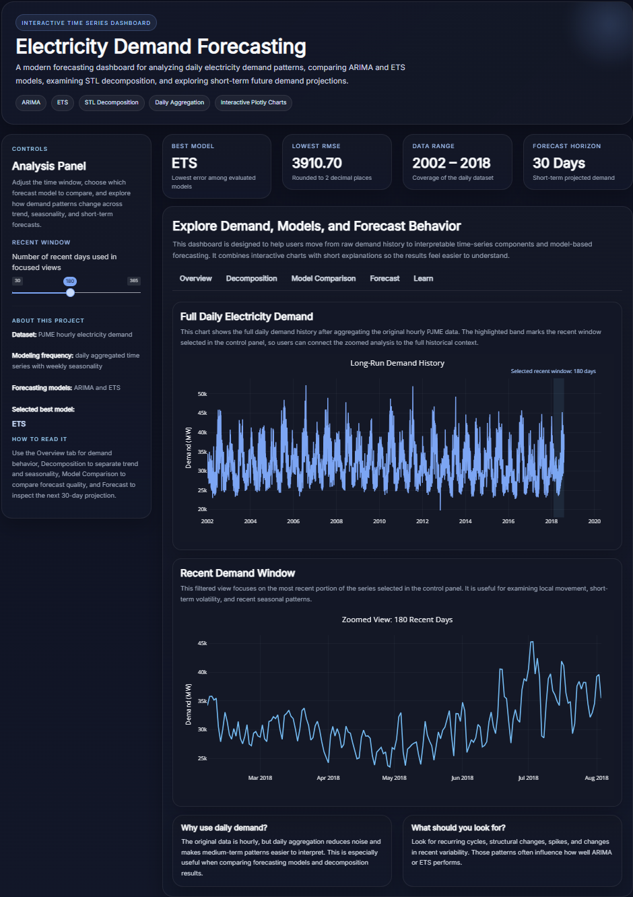

# Electricity Demand Forecasting Dashboard

**Tech stack:** R • Shiny • Time Series • ARIMA • ETS • Plotly

Interactive time series analysis and forecasting of electricity demand using classical statistical models and an interactive Shiny dashboard.

## Live Demo

## Live Demo

[](YOUR_LINK)
---



---

# Overview

This project analyzes electricity demand data and builds forecasting models using classical time series techniques.

The dataset contains hourly electricity demand for the PJM East region (PJME). The workflow includes:

* Data cleaning and preprocessing
* Time series decomposition
* Stationarity testing
* Forecasting using ARIMA and ETS models
* Interactive visualization using a Shiny dashboard

The goal of this project is to explore electricity demand patterns and evaluate forecasting models.

---

# Dataset

**Source:** PJM Interconnection electricity demand dataset.

Original frequency:

* Hourly electricity demand

For modeling in this project:

* Data is aggregated to **daily electricity demand**
* The most recent **365 days** are used for forecasting

### Variables

| Variable | Description                     |
| -------- | ------------------------------- |
| Datetime | Timestamp of electricity demand |
| PJME_MW  | Electricity demand in megawatts |

---

# Project Structure

```
electricity-demand-forecast
│
├── data/
│   └── PJME_hourly.csv
│
├── scripts/
│   ├── load_data.R
│   ├── preprocess.R
│   ├── time_series_analysis.R
│   └── forecasting_models.R
│
├── dashboard/
│   ├── app.R
│   └── manifest.json
│
├── results/
│
├── dashboard_preview.png
├── README.md
└── .gitignore
```

---

# Methods

## Data Processing

The raw hourly dataset is processed using the following steps:

* Remove missing values
* Remove duplicate timestamps
* Convert hourly electricity demand into **daily averages**

## Time Series Analysis

Exploratory time series analysis includes:

* STL decomposition
* ACF and PACF analysis
* Augmented Dickey–Fuller stationarity test

These steps help identify trend, seasonality, and stationarity properties of the data.

---

# Forecasting Models

Two forecasting models are implemented and compared.

## ARIMA

* Automatically selected using `auto.arima()`
* Captures autocorrelation and seasonal patterns

## ETS (Exponential Smoothing)

* Models level and seasonal components
* Suitable for capturing smooth demand patterns

### Model Evaluation

Models are evaluated using:

* RMSE (Root Mean Squared Error)
* MAE (Mean Absolute Error)
* MAPE (Mean Absolute Percentage Error)

The best model is selected based on **RMSE**.

---

# Dashboard Features

The Shiny dashboard provides interactive exploration of electricity demand.

## Demand Overview

* Full electricity demand time series
* Recent demand visualization with adjustable time window

## Time Series Decomposition

Displays the components of the time series:

* Trend
* Seasonal component
* Remainder (noise)

## Model Comparison

* Actual demand vs ARIMA forecast
* Actual demand vs ETS forecast
* Model accuracy comparison table

## Future Forecast

* 30-day electricity demand forecast using the best model

## Model Summary

Displays the model selected as best based on RMSE.

---

# Running the Project

Clone the repository and install the required R packages.

Install dependencies:

```r
install.packages(c(
  "shiny",
  "plotly",
  "tidyverse",
  "forecast",
  "tseries",
  "lubridate",
  "bslib"
))
```

Run the dashboard locally:

```r
setwd("electricity-demand-forecast")
shiny::runApp("dashboard")
```

---

# Outputs

The project generates several outputs including:

* STL decomposition plots
* ARIMA forecast plots
* ETS forecast plots
* Forecast comparison tables
* Future demand forecasts

These outputs are saved in the `results/` directory.

---

# Technologies Used

* R
* Shiny
* Plotly
* Tidyverse
* forecast
* tseries
* lubridate
* bslib

---

# Future Improvements

Possible extensions for this project include:

* Adding Prophet or machine learning forecasting models
* Including hourly forecasting
* Incorporating weather variables as predictors
* Adding more advanced model diagnostics
* Improving dashboard interactivity

---

# Author

# Author

**Giodanno Limin**

- Applied Statistics Specialist  
- University of Toronto